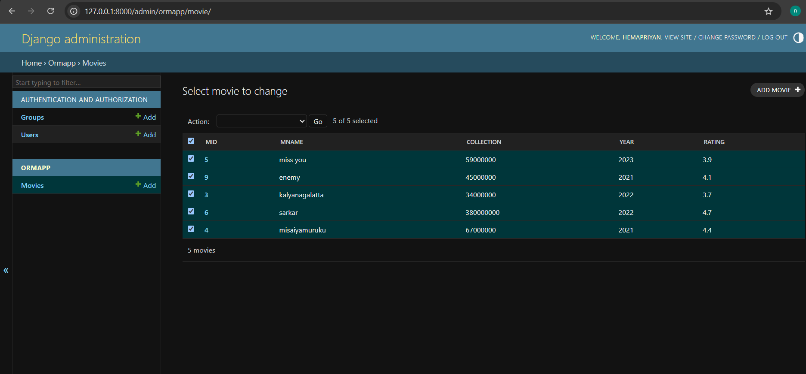

# Ex02 Django ORM Web Application
## Name: Hemapriyan P
# AIM
To develop a Django application to store and retrieve data from a bank loan database using Object Relational Mapping(ORM).

# ENTITY RELATIONSHIP DIAGRAM


## DESIGN STEPS
## STEP 1:
Clone the problem from GitHub

## STEP 2:
Create a new app in Django project

## STEP 3:
Enter the code for admin.py and models.py

## STEP 4:
Execute Django admin and create details for 10 books

# PROGRAM
```
models.py
from django.db import models
from django.contrib import admin
class Movie(models.Model):
    mid=models.IntegerField()
    mname=models.CharField(max_length=100)
    collection=models.IntegerField()
    year=models.IntegerField()
    rating=models.FloatField()

class MovieAdmin(admin.ModelAdmin):
    list_display=('mid','mname','collection','year','rating')

admin.py
from django.contrib import admin
from .models import Movie,MovieAdmin
admin.site.register(Movie,MovieAdmin)

```
# OUTPUT


# RESULT
Thus the program for creating a database using ORM hass been executed successfully
